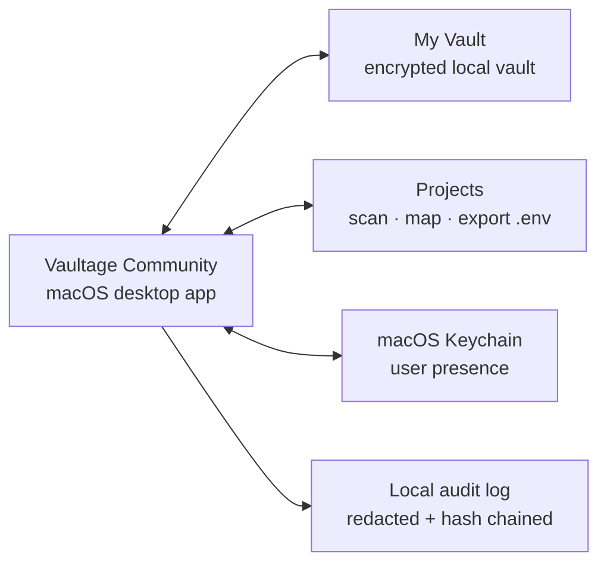

<div align="center">

# Vaultage

**A local-first macOS vault for developer secrets and project environments.**

Vaultage Community keeps credentials encrypted on your Mac and maps them into
local projects without an account or hosted sync.

<p>
  <a href="https://github.com/VAULTAGE01/Vaultage/actions/workflows/ci.yml?query=branch%3Amain"></a>
  <a href="./LICENSE"></a>
  
</p>

</div>

> This repository is pre-release source for inspection and development. Vaultage
> has not published an official Community binary that is notarized or
> customer-ready. Signed-evaluation prereleases, when listed on the
> [GitHub Releases page](https://github.com/VAULTAGE01/Vaultage/releases), are
> not notarized or customer-ready; follow the exact release label and notes.
> The current public [v0.1.4 release record](https://github.com/VAULTAGE01/Vaultage/releases/tag/v0.1.4)
> describes a signed-evaluation prerelease: it is not notarized or
> customer-ready. Follow the exact release label and notes; macOS may require
> **right-click Open** on first launch.

> **Native vNext transition:** this branch is the clean public migration line
> for the Swift macOS app and its iOS fast-follow. The current Electron
> Community implementation remains on `main`; `legacy/electron` preserves the
> exact pre-pivot baseline. The first reviewed `VaultageCore` Swift package is
> now present; later client composition will arrive only through the reviewed
> public export boundary described in
> [docs/native-vnext.md](./docs/native-vnext.md). This branch is not yet a
> customer release or a replacement for the current production app.

## What is Vaultage?

Vaultage Community is a complete local tool for organizing developer
credentials and the projects that use them. Keep secrets, API keys, secure
notes, and local environment values in one encrypted vault, then choose exactly
what a project may export to a plaintext `.env` file.

The supported desktop and packaging target is macOS 12 or newer. Windows and
Linux installers are not implemented or advertised.

The Community source surface is intentionally limited to **My Vault** and
**Projects**. It does not require an account and has no active-Project limit.
See the [source boundary](./docs/repo-structure.md).

## Community at a glance

| Surface | What you can do |
| --- | --- |
| **My Vault** | Organize encrypted secrets, folders, secure notes, images, metadata, import/export, reveal/copy flows, and local audit history. |
| **Projects** | Attach local folders, scan project files, map environment keys to vault fields, and explicitly export `.env` files. |

Use both surfaces without an account or hosted sync. Sensitive values stay on
the local trust boundary until an intentional action exports or reveals them.

## How it fits together



## Security posture

Current guarantees live in [SECURITY.md](./SECURITY.md). The important
constraints are:

- Vault data is encrypted locally; macOS user-presence unlock uses a key
  wrapped by the master password and may restore it to a this-device-only
  macOS Keychain item (Touch ID when available; macOS may offer a
  system-password fallback).
- Plaintext JSON and `.env` export flows require flow-specific explicit
  confirmation: macOS user presence where configured, or exact typed
  confirmation where specified. Non-macOS builds are not a supported product.
- Protected password inputs use macOS Secure Event Input while focused.
- CSV import has explicit size and parser-shape limits before creating secrets.
- Sensitive main-process events are written to a redacted, hash-chained local
  audit log foundation.

## Install

### Requirements

- macOS 12 or newer
- Node.js 22.12 or newer
- pnpm 11.11.0

### Run from source

```sh
git clone https://github.com/VAULTAGE01/Vaultage.git
cd Vaultage
pnpm install
pnpm dev
```

The app opens to the local-vault setup flow. No account is required.

If you use a signed-evaluation prerelease, it is not notarized and macOS may
require **right-click Open** on first launch. Treat the exact release notes as
the installation authority.

## Use it

1. Create or unlock the local vault.
2. Add secrets, secure notes, or environment values in **My Vault**.
3. Open **Projects**, attach a local folder, and run a scan.
4. Review the discovered environment keys and map them to saved vault fields.
5. Export a project `.env` file only after reviewing and confirming the
   selected fields.

Build the Community artifact locally with:

```sh
pnpm build:open-local
```

## Development and contributing

Run the complete Community gate before opening a pull request:

```sh
pnpm verify:release
```

Useful focused checks:

```sh
pnpm test
pnpm exec tsc --noEmit --pretty false -p tsconfig.node.json
pnpm exec tsc --noEmit --pretty false -p tsconfig.web.json
pnpm check:boundaries
pnpm check:schemas
pnpm check:source-drop-secrets
pnpm check:open-artifact
```

Read [CONTRIBUTING.md](./CONTRIBUTING.md) before contributing. Keep real
secrets, vault files, screenshots of secret values, and `.env`
contents out of issues and pull requests. Report suspected vulnerabilities
privately through [SECURITY.md](./SECURITY.md).

Product, feature, architecture, and release docs live in
[docs/README.md](./docs/README.md). See [docs/ci-cd.md](./docs/ci-cd.md) for
CI and release protocol, and [docs/repo-structure.md](./docs/repo-structure.md)
for the public source boundary.

## License

The public Community source distribution is licensed under Apache-2.0; see
[LICENSE](./LICENSE).

Vaultage is a project, product, and brand of Arcalab, a sole proprietorship.
See [NOTICE](./NOTICE) and [DISCLAIMER.md](./DISCLAIMER.md) for ownership,
no-warranty, misuse, and liability notices. See [TRADEMARK.md](./TRADEMARK.md)
for the policy covering the Vaultage name, logos, official builds, and release
channels.
