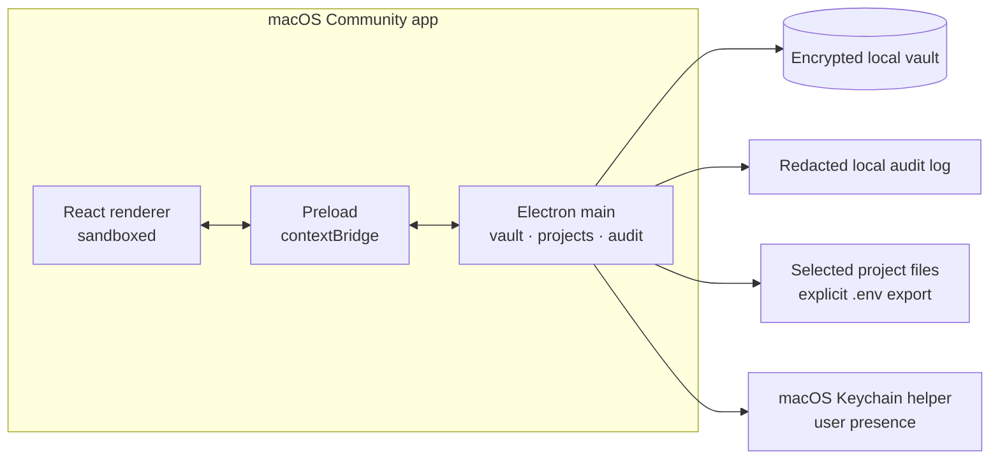

# Vaultage

Vaultage Community is a local-first macOS desktop vault for API keys,
passwords, secure notes, and project environment values. It keeps those values
in one encrypted local vault and maps them into local Projects.

## What is Vaultage?

Vaultage Community is the accountless, open-source Vault + Projects surface.
This repository is pre-release source for inspection and development. The public
signed-evaluation artifact is a candidate, not a customer-ready release or
production distribution. Vaultage has not published an official Community binary
for general use or a customer-ready release.

The release operator defaults to a **SIGNED EVALUATION — NOT NOTARIZED**
prerelease mode. Those builds are Developer ID signed but are not
production-ready, and macOS may require **right-click Open** on first launch.
The fully notarized mode remains available when Apple account credentials are
configured.

The supported desktop and packaging target is macOS 12 or newer. Windows and
Linux installers are not implemented or advertised.

## Features

- **My Vault** — folders, secrets, secure notes, image secrets, import/export,
  reveal/copy controls, global search, and local audit viewing/export.
- **Projects** — local project records, project scanning, environment-key
  mapping, and explicit `.env` export from selected vault fields.
- **macOS user-presence unlock** — Touch ID when available; macOS may offer
  system-password fallback.
- **Local-first security** — the Community build requires no account and keeps
  vault data, project scans, and exports on the user's machine.

## What you can do with it

- Set up and unlock a local encrypted vault with a master password and macOS
  user presence when available.
- Organize API keys, passwords, SSH keys, secure notes, custom fields, and
  images; import CSV data; search and pin frequently used secrets.
- Scan a selected local project for environment keys, map those keys to vault
  fields, and explicitly export a `.env` file.
- Review redacted local audit events, export audit data, and lock the vault
  manually or when macOS/app lifecycle events require it.

## Architecture



The renderer receives redacted vault snapshots. The main process owns unlock,
storage, audit, project scanning, and plaintext release actions. The preload
bridge exposes only the Community Vault + Projects IPC surface.

## Security and secrets

Vault data is encrypted locally. The vault key is wrapped by a
master-password-derived key and may also be restored to a this-device-only
macOS Keychain item gated by local user presence. Sensitive values are resolved
in the main process for copy, reveal, and export actions after the applicable
confirmation.

Plaintext JSON and `.env` export are intentional, user-visible actions. Keep
exported files out of version control and read [SECURITY.md](./SECURITY.md) for
the current guarantees, limitations, and private reporting process.

## Run it locally

This is pre-release source, not a published installer. On a supported macOS
development machine:

```sh
pnpm install
pnpm verify:release
```

Useful focused checks:

```sh
pnpm test
pnpm exec tsc --noEmit --pretty false -p tsconfig.node.json
pnpm exec tsc --noEmit --pretty false -p tsconfig.web.json
pnpm check:boundaries
pnpm check:schemas
pnpm check:source-drop-secrets
pnpm build:open-local
pnpm check:open-artifact
```

See [docs/README.md](./docs/README.md) for the docs map and
[docs/ci-cd.md](./docs/ci-cd.md) for CI and release protocol.

## Contributing

Vaultage's public contribution posture is still pre-release. Read
[CONTRIBUTING.md](./CONTRIBUTING.md) and [docs/governance.md](./docs/governance.md)
for the current process and Community boundary. Never submit real secrets,
vault files, provider credentials, screenshots of secret values, or `.env`
contents.

## Commercial Editions

Vaultage Community protects local secrets and maps them to local projects.
Closed commercial editions may add account-gated automation and hosted
workflows. Agent workflows, CLI helpers, Services/provider connectors, managed
OAuth, token lifecycle automation, browser extension code, cloud sync/audit,
spend dashboards, signing identities, and private paid modules are not part of
this public source distribution.

## Going deeper

- [Product brief](./docs/product.md) — product surface, principles, and
  non-goals.
- [Feature inventory](./docs/features.md) — current Community capabilities and
  source pointers.
- [Architecture](./docs/architecture.md) — process model, trust boundaries,
  IPC, and data model.
- [Project scanning](./docs/project-scanning.md) — local scan behavior and
  privacy boundaries.
- [Release provenance](./docs/release-provenance.md) — source and artifact
  verification expectations.
- [Legal notices](./NOTICE), [disclaimer](./DISCLAIMER.md), and
  [trademark policy](./TRADEMARK.md).

## License

The public Community source distribution is licensed under Apache-2.0.

Vaultage is a project, product, and brand of Arcalab, a sole proprietorship.
See [NOTICE](./NOTICE) and [DISCLAIMER.md](./DISCLAIMER.md) for ownership,
no-warranty, misuse, and liability notices.
